```mermaid
%% GENERATED — do not hand-edit. Source: architecture.dsl · regenerate with `make diagrams`
flowchart LR
    A[<input / source>] --> B[<core capability>]
    B --> C[<validation / eval gate>]
    C --> D[<output / action>]
    C -.->|below threshold| E[<human review / fallback>]
```

<!--
=====================================================================
 FLAGSHIP README STANDARD  (copy to <repo>/README.md and fill <...> tokens)
 Design rules (from 2026 hiring-manager research + your roadmap standard):
   • First ~200 words carry the whole 40-second scan: what → why-different → result → demo.
   • Badges are FUNCTIONAL only (CI, coverage, version, license, eval-gate). No vanity badges.
   • Required by your cross-project standard: Mermaid diagram, Dockerfile, eval table,
     15–30s demo GIF, "What I Learned".
   • Keep the top scannable; put depth in <details> blocks. If it needs a TOC, it's too long —
     push deep docs to /docs and link them.
   • Lead with the FINANCE domain framing — it's your unfair advantage; use it in the first line.
=====================================================================
-->

# <Project Name> — <one-line, finance-framed value prop>
<!-- e.g. "AFC — predictive trigger analysis for small-cap stocks, with statistical rigor built in"
     e.g. "FormSense — autonomous document operations for retirement-plan distribution processing" -->

[](https://github.com/manuel-reyes-ml/<repo>/actions)
[](https://codecov.io/gh/manuel-reyes-ml/<repo>)
[](https://www.python.org/)
[](#-evaluation)
[](LICENSE)
[](#-context--roadmap)

> **The problem.** <2–3 sentences, domain-specific. What real, messy problem does this solve, and for whom?
> Generic dies here — "RAG over PDFs" is invisible; "RAG over retirement-plan documents to answer
> distribution-eligibility questions" signals domain thinking.>

> **The result.** <One quantified outcome. "Cuts human-review rate 62%"; "$15K/yr saved on 1099
> reconciliation"; "beats momentum baseline by X on walk-forward expectancy". Numbers get you forwarded.>

<!-- HERO: the single highest-signal element (84% of hiring managers look for a working demo). -->
### ▶️ Demo
<!-- 15–30s GIF (autoplays inline) AND/OR a live link. Host: Streamlit / HF Spaces / Gradio. -->

**Live demo:** <https://…>  ·  **Walkthrough (2 min):** <https://…>

---

## 🏗️ Architecture
<!-- Required by your standard. Keep it legible; this is what non-technical reviewers read. -->


<!-- DATA QUALITY & RELIABILITY — this is how a DE project shows production rigor without a
     separate "DE section". Keep it to 2–3 lines. Omit entirely for non-pipeline projects. -->
**Data quality & reliability.** <Orchestration + cadence (e.g. Airflow DAG, daily run)> ·
<idempotent reruns / no duplicate keys> · <null-handling + dtype enforcement> ·
<lineage: source + snapshot version; failure = retry N× then alert>.

## 🚀 Quick start
<!-- 3 steps max, copy-paste. pyproject.toml is the single source of deps (NO requirements.txt). -->
```bash
git clone https://github.com/manuel-reyes-ml/<repo>.git && cd <repo>
uv sync                      # or: pip install -e ".[dev]"
cp .env.example .env         # add keys; never commit real secrets
python -m <package> --help   # run it
```
Docker:
```bash
docker build -t <repo> . && docker run --env-file .env <repo>
```

## 🧪 Evaluation
<!-- Required by your standard AND your #1 differentiator. Show gates, not vibes. -->
> Accuracy is the product, so it's **gated in CI**, not hoped for. Thresholds block release.

| Metric | Tool | Threshold (gate) | Latest |
|--------|------|------------------|-------:|
| <Faithfulness / groundedness> | <DeepEval / RAGAS> | ≥ 0.90 | <0.xx> |
| <Context relevance / recall> | <RAGAS> | ≥ <0.xx> | <0.xx> |
| <Field-extraction accuracy> | <GEval> | ≥ baseline | <0.xx> |
| <Task-specific metric> | <custom labeled set> | <gate> | <0.xx> |

<!-- Earned-overlay note: any ML/loop overlay ships only if it beats its baseline on the labeled set. -->

<!-- MODEL CARD — include this line ONLY for projects that train/fine-tune a model
     (e.g. FormSense Stage-3 fine-tuned extractor, Crucible prediction engine).
     Delete it for RAG-only / rules-only / ETL projects (AFC, plain pipelines). -->
📋 **Model card:** intended use, limitations, and failure modes → [`docs/MODEL_CARD.md`](docs/MODEL_CARD.md)

---

<details>
<summary><b>🧠 How it works — key design decisions</b></summary>

<!-- The depth reviewers open when the top convinced them. 3–6 decisions with the *why* and the tradeoff. -->
- **<Decision>:** <what you chose> because <why>; tradeoff was <what you gave up>.
- **<Decision>:** …
</details>

<details>
<summary><b>🧰 Tech stack</b></summary>

| Layer | Tools |
|-------|-------|
| Language | Python 3.12 · SQL |
| <Data / lakehouse> | <DuckDB · Parquet · dbt · Airflow> |
| <Model / inference> | <local Ollama · Gemini Vision · Anthropic SDK> |
| <Vector / graph> | <ChromaDB · Neo4j (GraphRAG)> |
| Eval | DeepEval · RAGAS · GEval |
| Serving / infra | <FastAPI · Docker · AWS ECS/S3> |
| Quality | pytest · ruff · mypy · pre-commit · GitHub Actions |
</details>

<details>
<summary><b>📁 Project structure</b></summary>

```
<repo>/
  src/<package>/
    <core/>          # signature capability
    eval/            # labeled sets · thresholds · regression gates
    guardrails/
    schemas/         # Pydantic contracts
  tests/
  docs/              # deep docs · assets/demo.gif · architecture
  pyproject.toml     # py.typed · src layout · semver
  Dockerfile
  .env.example
```
</details>

<!-- ===== CAPABILITY SECTIONS — keep ONLY the ones this project uses ===== -->

<details>
<summary><b>🟪 LLM / RAG details</b></summary>

- **Retrieval:** <chunking · top-k · embedding model · reranker> · store: <ChromaDB / Neo4j>
- **Prompts:** versioned in `src/<package>/prompts/`; changes go through eval before promotion.
- **Cost & latency:** <tokens/call · est. $/run · p95 ms>.
- **Privacy-first routing:** finance/proprietary data → **local Ollama**; never free/training-eligible tiers.
- **Guardrails:** Pydantic output validation · PII handling · prompt-injection surface.
</details>

<details>
<summary><b>🟧 Agentic & safety</b> (autonomous loops / trading / actions)</summary>

- **Type & autonomy:** <workflow vs agent> · tier: <read-only / draft / write / irreversible>.
- **Tools & permissions:** <exact tools + least-privilege scopes>.
- **Loop:** trigger → plan → act → check → retry; exits: <max iters · cost cap>.
- **🛑 Human oversight:** <sign-off gate on irreversible actions> · **kill-switch** present & tested;
  kill-switch events logged. *(Crucible: deterministic engine owns every trade; LLM never places one.)*
- **Provenance:** run manifests (`run_id` · git SHA · data-snapshot version · seeds) make every result reproducible.
- **⚠️ Disclaimer:** research/educational; not financial advice.
</details>

---

## 📚 What I Learned
<!-- Required by your standard — and your finance-to-tech narrative hook. 3–5 honest bullets:
     a hard bug, a tradeoff you'd revisit, a domain insight that shaped the design. -->
- <lesson 1>
- <lesson 2>

## 🗺️ Context & roadmap
<!-- One line placing this in your 5-stage transition; link the stage if public. -->
Stage <N> of a finance→LLM-engineering roadmap. <One line on where this fits.>

## 📄 License
<MIT> — see [LICENSE](LICENSE). Sample data is synthetic/masked; no real client data is included.