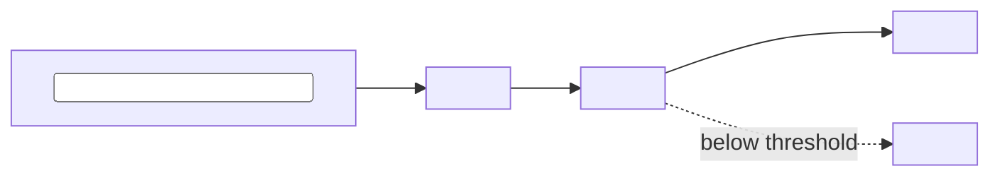

<!--
=====================================================================
 FLAGSHIP README STANDARD  (copy to <repo>/README.md and fill <...> tokens)
 Synced to roadmap v10.0 · Correction 18 (Production / Cost / Architecture).
 Design rules:
   • The header + demo carry the 40-second scan: what → why-different → outcome → demo.
   • The first three SECTIONS are, in order: ① Production · ② Cost · ③ Architecture.
     Everything else follows them. Order changes; content does not.
   • Badges are FUNCTIONAL only (CI, coverage, version, license, eval-gate). No vanity badges.
   • Required by the cross-project standard: Mermaid diagram (GENERATED from architecture.dsl),
     C4 Context, docs/adr/, Dockerfile, eval table, 15–30s demo GIF, "What I Learned".
   • Keep the top scannable; put depth in <details> blocks. If it needs a TOC, it's too long —
     push deep docs to /docs and link them.
   • Lead with the FINANCE domain framing — it's the domain edge; use it in the first line.
 HONESTY DISCIPLINE (binding): use a number only where you could defend it in an interview.
   Where a metric can't be shared, substitute scale + reliability outcomes. Never invent a
   figure to fill a token. Every figure must clear the "would I say this in a deposition" test.
 DISCLOSURE: no absolute dollar amounts, participant/plan data, client identifiers, or
   identifying record volumes. Crucible: no P&L, returns, or account figures — ever.
=====================================================================
-->

# <Project Name> — <one-line, finance-framed value prop>
<!-- e.g. "AFC — predictive trigger analysis for small-cap stocks, with statistical rigor built in"
     e.g. "FormSense — autonomous document operations for retirement-plan distribution processing" -->

[](https://github.com/manuel-reyes-ml/<repo>/actions)
[](https://codecov.io/gh/manuel-reyes-ml/<repo>)
[](https://www.python.org/)
[](#-evaluation)
[](LICENSE)
[](#-context--roadmap)
<!-- Eval badge: baseline is ≥0.85 faithfulness. Use ≥0.90 ONLY for AFC and Crucible. -->

> **The problem.** <2–3 sentences, domain-specific. What real, messy problem does this solve, and for whom?
> Generic dies here — "RAG over PDFs" is invisible; "RAG over retirement-plan documents to answer
> distribution-eligibility questions" signals domain thinking.>

> **The outcome.** <One defensible result. Prefer scale + reliability over a headline number:
> "cuts manual review to a documented exception path"; "reconciles N synthetic plan-years nightly at
> a 99.x% match rate"; "beats the momentum baseline on walk-forward expectancy". If you can't defend
> the number in an interview, state the scale and the reliability instead — that is not a weaker claim.>

### ▶️ Demo
<!-- 15–30s GIF (autoplays inline) AND/OR a live link. Host: Streamlit / HF Spaces / Gradio. -->

**Live demo:** <https://…>  ·  **Walkthrough (2 min):** <https://…>

---

## ① 🏭 Production
<!-- Where it RUNS and who DEPENDS on it. A stack list is not a production claim — if nothing
     depends on it and nothing watches it, say so honestly and describe it under Architecture. -->

- **Runs on:** <deploy target — Docker on <host> / ECS / scheduled job> · **cadence:** <daily 06:00 ET>
- **Depended on by:** <the downstream consumer, team, or process — or "portfolio demo only">
- **Deploy path:** GitHub Actions → `uv sync --frozen` → Docker image → <target>
- **Observability:** `structlog` JSON to stdout; canonical events `<event_a>`, `<event_b>`;
  run context bound via `run_id` contextvar
- **Reliability:** <success rate over N runs> · <freshness / SLA> · retries via `stamina`
  (<N> attempts, <T>s total cap, transient only) · failure path: <retry → alert → manual review>
- **Blocking gates to merge:** ruff · mypy · pytest · **eval thresholds** (see [Evaluation](#-evaluation))

## ② 💰 Cost
<!-- The number AND the mechanism, with the reliability it held to. A saving that hides a
     regression is a bait-and-switch — always state the SLA the change respected.
     OPTIONAL for FormSense and AFC. DataVault's will be thin by design (disclosure limits).
     DELETE this section rather than manufacture one. -->

- **Unit economics:** <est. $ per run / per 1k queries> · <tokens per call in/out> · <p95 latency>
- **What changed and why:** <e.g. routed bulk extraction to local Ollama, reserving the cloud model
  for <specific step>; cut cost-per-document by <relative delta>>
- **Mechanism:** <sizing / caching / partitioning / model routing / batching — name it>
- **Reliability held:** <the SLA or eval threshold that did NOT regress while cost fell>
- **Manual effort removed:** <hours per cycle, or the step eliminated — no dollar conversion>

## ③ 🏗️ Architecture


```mermaid
%% GENERATED — do not hand-edit. Source: architecture.dsl · regenerate with `make diagrams`
flowchart LR
    A[<input / source>] --> B[<core capability>]
    B --> C[<validation / eval gate>]
    C --> D[<output / action>]
    C -.->|below threshold| E[<human review / fallback>]
```

- **C4 Context:** [`docs/diagrams/context.md`](docs/diagrams/context.md) <!-- required on every project -->
- **C4 Container:** [`docs/diagrams/container.md`](docs/diagrams/container.md) <!-- lead flagships only -->
- **Model source:** [`architecture.dsl`](architecture.dsl) (Structurizr DSL — single source, exported to Mermaid)
- **Decisions:** [`docs/adr/`](docs/adr/) — <N> records. Key ones:
  - [`0002-…`](docs/adr/0002-….md) — <decision>; rejected <alternative> because <reason>
  - [`0003-…`](docs/adr/0003-….md) — <decision>; rejected <alternative> because <reason>
- **Contracts:** Pydantic schemas in `src/<package>/schemas/`; validated at every trust boundary
- **Layer boundaries:** <one line on what each layer may return>

<!-- DATA QUALITY & RELIABILITY — how a DE project shows production rigor without a separate
     "DE section". 2–3 lines. Omit entirely for non-pipeline projects. -->
**Data quality & reliability.** <Orchestration + cadence (e.g. Airflow DAG, daily run)> ·
<idempotent reruns / no duplicate keys; retried writes carry an idempotency key> ·
<null-handling + dtype enforcement> · <lineage: source + snapshot version>.

---

## 🚀 Quick start
<!-- 3 steps max, copy-paste. pyproject.toml + uv.lock are the single source of deps. -->
```bash
git clone https://github.com/manuel-reyes-ml/<repo>.git && cd <repo>
uv sync --frozen             # exact locked env; fails loudly if uv.lock is stale
cp .env.example .env         # add keys; never commit real secrets
uv run python -m <package> --help
```
Docker:
```bash
docker build -t <repo> . && docker run --env-file .env <repo>
```

## 🧪 Evaluation
> Accuracy is the product, so it's **gated in CI**, not hoped for. Thresholds block the merge.

| Metric | Tool | Threshold (gate) | Latest |
|--------|------|------------------|-------:|
| <Faithfulness / groundedness> | <DeepEval / RAGAS> | ≥ <0.85> | <0.xx> |
| <Answer relevancy> | <DeepEval> | ≥ 0.80 | <0.xx> |
| <Hallucination> | <DeepEval> | < <0.15> | <0.xx> |
| <Context relevance / recall> | <RAGAS> | ≥ <0.xx> | <0.xx> |
| <Tool correctness / task completion> | <DeepEval agentic> | <1.00 / ≥0.80> | <0.xx> |
| <Field-extraction accuracy> | <GEval> | ≥ baseline | <0.xx> |

- **Labeled set:** <N ≥ 30> cases incl. edge, out-of-scope, adversarial and PII-probing inputs
- **Judge:** <local Ollama (finance/proprietary) | cloud (public data only)>
- **Raised bar** applies to AFC and Crucible only: faithfulness ≥ 0.90, hallucination < 0.10
<!-- Earned-overlay note: any ML/loop overlay ships only if it beats its baseline on the labeled set. -->

<!-- MODEL CARD — include this line ONLY for projects that train/fine-tune a model
     (e.g. FormSense Stage-3 fine-tuned extractor, Crucible prediction engine).
     Delete it for RAG-only / rules-only / ETL projects (AFC, plain pipelines). -->
📋 **Model card:** intended use, limitations, and failure modes → [`docs/MODEL_CARD.md`](docs/MODEL_CARD.md)

---

<details>
<summary><b>🧠 How it works — key design decisions</b></summary>

<!-- 3–6 decisions with the *why* and the tradeoff. Each one that had a real rejected
     alternative should ALSO exist as an ADR — link it. -->
- **<Decision>:** <what you chose> because <why>; tradeoff was <what you gave up>. → [`ADR-000N`](docs/adr/)
- **<Decision>:** …
</details>

<details>
<summary><b>🧰 Tech stack</b></summary>

| Layer | Tools |
|-------|-------|
| Language | Python 3.12 · SQL |
| Env / packaging | uv (`uv.lock`) · pyproject.toml · `src/` layout · `py.typed` |
| <Data / lakehouse> | <DuckDB · Parquet · dbt · Airflow> |
| <Model / inference> | <local Ollama (privacy-first default) · Anthropic SDK (primary cloud)> |
| <Vector / graph> | <ChromaDB · Neo4j (GraphRAG)> |
| Observability | structlog · stamina · pydantic-settings |
| Eval | DeepEval · RAGAS · GEval |
| Serving / infra | <FastAPI · Docker · AWS ECS/S3> |
| Architecture docs | Structurizr DSL → Mermaid · C4 · ADR |
| Quality | pytest · ruff · mypy · GitHub Actions |
</details>

<details>
<summary><b>📁 Project structure</b></summary>

```
<repo>/
  AGENTS.md          # agent contract (Cursor + OpenCode + Claude Code)
  architecture.dsl   # Structurizr C4 model — single source
  src/<package>/
    py.typed
    config/settings.py   # pydantic-settings — the only place env is read
    observability/       # configure_logging() + redact_pii processor
    <core/>              # signature capability
    ai/                  # provider · schemas · guardrails · observability
    schemas/             # Pydantic contracts
  tests/               # unit · integration · test_eval.py · eval_dataset.json
  docs/
    adr/               # architecture decision records
    diagrams/          # generated Mermaid exports
    assets/demo.gif
  pyproject.toml
  uv.lock            # committed — exact pins + hashes
  Dockerfile
  .env.example
```
</details>

<!-- ===== CAPABILITY SECTIONS — keep ONLY the ones this project uses ===== -->

<details>
<summary><b>🟪 LLM / RAG details</b></summary>

- **Retrieval:** <chunking · top-k · embedding model · reranker> · store: <ChromaDB / Neo4j>
- **Prompts:** versioned in `src/<package>/prompts/`; changes go through eval before promotion.
- **Cost & latency:** <tokens/call · est. $/run · p95 ms> — mirrored in **② Cost**.
- **Privacy-first routing:** finance/proprietary data → **local Ollama**; Anthropic SDK as primary
  cloud; provider from `settings.ai_provider`, fallback is **local, never cloud**;
  never free/training-eligible tiers.
- **Guardrails:** Pydantic output validation · response-side PII scan before display ·
  prompt-injection surface.
- **Observability:** per-query provider · model · tokens · latency · cost · guardrail status,
  logged as structlog kwargs with `query_id` bound to contextvars.
</details>

<details>
<summary><b>🟧 Agentic & safety</b> (autonomous loops / trading / actions)</summary>

- **Type & autonomy:** <workflow vs agent, Anthropic taxonomy> · tier: <read-only / draft / write / irreversible>.
- **Tools & permissions:** <exact tools + least-privilege scopes>.
- **Loop:** trigger → plan → act → check → retry; exits: <max iters · cost cap>.
- **🛑 Human oversight:** sign-off gate on irreversible actions — no auto-approve, no
  timeout-approve, no confidence-threshold bypass · **kill-switch** present & tested, halting
  independently of the agent loop; `human_signoff_required` and `killswitch_engaged` events logged.
- **Eval scores never authorize execution** — a PASS means threshold met, not cleared to act.
  *(Crucible: deterministic engine owns every trade; the LLM never places or times one.)*
- **Provenance:** run manifests (`run_id` · git SHA · data-snapshot version · seeds) make every result reproducible.
- **⚠️ Disclaimer:** research/educational; not financial advice. No P&L, returns, or account figures.
</details>

---

## 📚 What I Learned
<!-- 3–5 honest bullets: a hard bug, a tradeoff you'd revisit, a domain insight that shaped
     the design. The finance-to-tech narrative hook lives here. -->
- <lesson 1>
- <lesson 2>

## 🗺️ Context & roadmap
<!-- One line placing this in the three-stage transition:
     Stage 1 Internal AI Builder → Stage 2 AI-Focused Data Engineer / Analytics Engineer
     → Stage 3 Applied AI Engineer / Forward Deployed Engineer track. -->
Stage <N> of a finance→AI-engineering roadmap. <One line on where this fits.>

## 📄 License
<MIT> — see [LICENSE](LICENSE). Sample data is synthetic; no real client data is included.